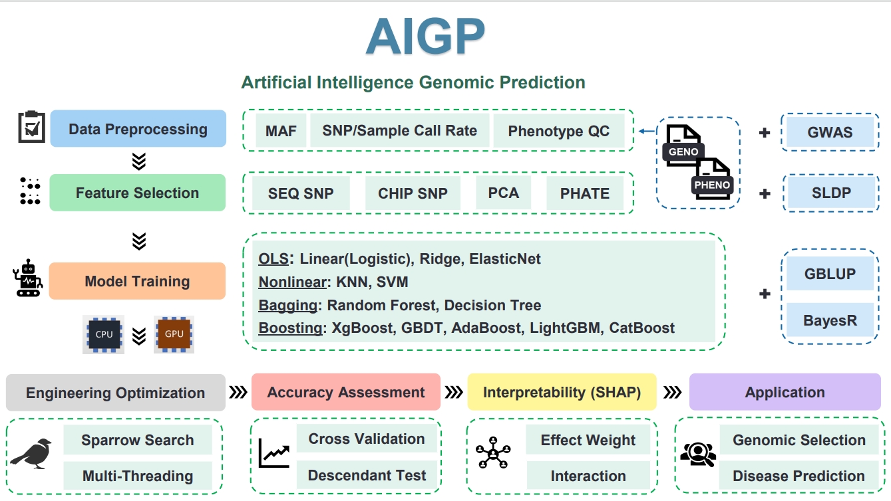

#### AIGP: An interpretable Artificial Intelligence Genomic Prediction framework





# AIGP Software Manual Directory


# 1. Introduction to AIGP

  ------

  With the advancement of sequencing technologies and the emergence of high-throughput genomic data, breeding practices are transitioning from traditional "empirical breeding" to "precision breeding". Artificial intelligence (AI) algorithms, which do not require predefined rules, excel at learning from data and features, fitting complex nonlinear relationships within the data. This capability gives them an edge in handling vast amounts of genomic data. The application of AI algorithms in genomic prediction is crucial for enhancing the accuracy of breeding value estimation for key phenotypes, accelerating genetic progress, and streamlining the breeding process.

  Artificial Intelligence Breeding Pipeline (AIGP) is an AI breeding software that integrates feature selection, model building, speed optimization, parameter tuning, and locus interpretability. It can process data under various supervised learning conditions, including but not limited to genomics, transcriptomics, and methylation data. AIGP can incorporate prior information, seasonal effects, gender, batch, and other covariate information, and it encompasses a variety of AI algorithm models for both qualitative and quantitative traits. It supports CPU and GPU computations, along with multi-process, multi-threading, optimization iteration, grid search, sparrow search, and SNP locus interpretability analysis modules.

  The software features include:

  1.**Significant Improvement in Prediction Speed**:AIGP supports accelerated data reading and GPU model training, which is particularly effective when dealing with large-scale data.
  
  2.**Flexibility and Adaptability**:AIGP methods can handle different types of data and tasks, including regression, classification, and data with complex nonlinear relationships, including but not limited to genomic, transcriptomic, and metabolomic data.
  
  3.**Nonlinear Fitting Optimization**:AIGP can automatically perform feature selection and evaluate feature importance through methods such as SHAP (SHapley Additive exPlanations), providing an in-depth understanding and interpretation of prediction results.
  
  4.**High Performance and Precision Prediction**:By using advanced models, the precision and performance of predictions can be significantly improved. These models demonstrate excellent performance in handling large-scale data and complex models through efficient gradient boosting techniques.
  
  5.**Automated Hyperparameter Tuning**:AIGP software integrates grid search and intelligent algorithms for automated parameter tuning, ensuring the best model performance on different datasets, which is more efficient than manual parameter tuning in the GBLUP method.
  
  6.**Covariate Handling**:AIGP can directly process categorical variables in the data, automatically encoding and processing them, while traditional GBLUP methods are more complex when dealing with categorical variables, requiring additional preprocessing steps.

  In addition, AIGP enhances prediction accuracy through various parameter optimization methods such as sparrow search and can mine SNP loci related to phenotypes based on the weight of SNPs in the model. By assessing the importance of SNP loci through various methods, generally, the greater the weight of the SNP locus, the stronger its correlation with the phenotype. The software outputs model interpretability through SHAP theory, including custom selection of feature loci for importance ranking, local and global interactive explanations based on single samples, multiple samples combined with features, and visualization display. Users can customize the interaction between different features and samples for further research. It is recommended that users compare the weights of various SNPs provided by different methods of AIGP with GWAS results for reference, to exclude false positive results from each method and increase credibility.

  AIGP has shown strong advantages in meeting the needs of genomic data analysis in the era of big data, capable of efficiently and accurately predicting and analyzing large-scale data. It provides new tools and software platforms for AI breeding and digitalization.
 

**Contact Us:** [leiwei@cau.edu.cn](leiwei@cau.edu.cn)  

**Note:** The software includes versions compatible with Linux and macOS command-line environments, as well as a Windows version with a graphical user interface for easier operation. However, we recommend using the Linux version when handling large-scale data for better performance.  


- The software is for academic use only, commercial use requires prior contact with us. The right to interpretation belongs to the National Key Laboratory of Animal and Poultry Breeding.  

# 2. Installation Guide

------

### Clone the Project Repository

Clone the project's GitHub repository to your local machine. Open the terminal and execute the following command:

```shell
git clone https://github.com/CAU-LEI/AIGP/data
cd AIGP
```

### Create a Virtual Environment

To ensure there are no conflicts between dependencies, it is recommended to use a virtual environment. You can use venv or conda to create a virtual environment. Create a virtual environment using venv:

```shell
python3 -m venv venv
source venv/bin/activate  # Linux/macOS
venv\Scripts\activate  # Windows
```

### Create a Virtual Environment with conda:

```shell
conda create --name AIGP_env python=3.8
conda activate AIGP
```

### Install Dependencies

Dependencies are listed in the requirements.txt file. Execute the following command to install:

```shell
pip install -r requirements.txt
```

Specific package versions in requirements.txt are:

```shell
pandas==1.3.3
numpy==1.21.2
scipy==1.7.1
scikit-learn==0.24.2
matplotlib==3.4.3
catboost==1.0.4
lightgbm==3.2.1
phate==1.0.7
shap==0.39.0
joblib==1.1.0
```

**PLINK Installation** AIGP software has a built-in plink module. After downloading the plink software, on Linux or macOS, edit the ~/.bashrc or ~/.zshrc file:

```shell
export PATH=$PATH:/path/to/plink
```

On Windows, configure it through the "Environment Variables" option in System Properties.

# 3. Major function


### Automatic Data Preprocessing  
- Automatically identifies genotype file formats (`.txt`, `.ped`, `.vcf`) and processes file conversion.  
- Automatically detects phenotype label columns and supports cleaning missing or invalid values.  

### Statistical Parameter Calculation  
- Computes genotype data parameters such as missing rate, allele frequency, and minor allele frequency (MAF) via parameter options.  
- Calculates phenotype data metrics, including mean and standard deviation, and automatically generates phenotype distribution plots.  

### Multiple Dimensionality Reduction Methods  
- Integrates **PCA** and **PHATE** for dimensionality reduction.  
- Reduces noise and computational complexity for high-dimensional data.  

### Multiple Machine Learning Models  
- Supports various machine learning models and accounts for fixed effects such as covariates.  

### Hyperparameter Tuning and Optimization  
- Integrates **Grid Search** and **SSA (Sparrow Search Algorithm, pseudo-implemented)** for hyperparameter tuning.  
- Supports **multithreading** for parallel computation.  

### Model Evaluation and Interpretation  
- **Classification Tasks**: Uses **accuracy** as the evaluation metric.  
- **Regression Tasks**: Uses **Pearson correlation coefficient** between predicted and actual values.  
- Supports **cross-validation** and outputs individual fold scores along with the average score.  
- Integrates **SHAP analysis module** for model interpretation, supporting visualizations such as:  
  - Beeswarm plots  
  - Heatmaps  
  - Waterfall plots  
  - Custom selection of the top N important features.  

### Feature Importance Output  
- Built-in **feature importance analysis**, allowing users to generate **feature importance plots** and corresponding **CSV files**.  

### Candidate Population Prediction  
- After evaluating model accuracy on the reference population, trained model weights can be used to predict candidate population data.  
- Requires only a **pre-trained model file** and **candidate population data**.  

### CPU/GPU Training Support  
- Allows users to choose **CPU or GPU** for model training via parameter settings.  


# 4. Pipeline Introduction

------

### Data Preprocessing

- The preprocessing module of the software supports statistics on the genotype frequency (minor allele frequency), genotype missing rate, and sample missing rate of the input genotypic data, and presents them in the form of histograms for output. This feature allows users to understand the overall status of the data and to devise subsequent research methods.

- In the preprocessing of phenotypic files, the module checks for missing phenotypic values. If missing values are found, the corresponding rows and genotype samples are automatically deleted. Additionally, it visualizes the distribution histogram of phenotypic values.

### Feature Engineering

- In the processing of genotype and phenotype data, feature engineering can effectively reduce data dimensions, decrease computational complexity, and retain key information from the data. The AIGP software supports two dimensionality reduction methods: PCA (Principal Component Analysis) and PHATE (Potential of Heat-diffusion for Affinity-based Transition Embedding).

- **PCA (Principal Component Analysis)** is a common dimensionality reduction technique that maps high-dimensional data to a low-dimensional space through orthogonal transformation, preserving the main information in the data. The main advantage of PCA is its ability to reduce data dimensions while retaining variance information, thereby simplifying model complexity and improving computational efficiency.

- **PHATE (Potential of Heat-diffusion for Affinity-based Transition Embedding)** is a state-of-the-art dimensionality reduction technique that requires no prior distribution. It uses gradient descent and matrix factorization to preserve the latent geometric structure and topological features of the data. By leveraging geometric distance information between data points, it captures both local and global nonlinear structures. PHATE is designed to handle noisy nonlinear relationships between data points. It generates a low-dimensional representation that maintains both local and global structures within the dataset, allowing for a comprehensive understanding of data structure based on the graph of relationships between entities within the dataset.

### Model Training

- The software supports a variety of machine learning models suitable for predicting both qualitative and quantitative traits. All machine learning methods in AIGP are categorized into four major groups: Ordinary Least Squares (OLS) regression, nonlinear methods, Bagging, and Boosting, encompassing a total of 13 models.  For quantitative traits, nonlinear methods include k-nearest neighbors (knn) and support vector machines (svm), linear methods include Linear Regression, Ridge Regression, and ElasticNet, and bagging methods include Random Forest (RF). Boosting algorithms include gradient boosting trees, xgboost, catboost, lightgbm, and catboost. For qualitative traits, nonlinear methods include knn and svm, linear methods include logistic regression, bagging methods include RF, and decision tree algorithms. Boosting algorithms include gradient boosting trees, xgboost, catboost, lightgbm, and catboost.

Users can select the appropriate model for training based on specific needs and optimize parameters using various methods to achieve the best performance.

### Model Evaluation

- In AIGP, for qualitative traits, accuracy is used as the evaluation metric. For quantitative traits, the Pearson correlation coefficient between predicted and actual values is used as the evaluation standard. When cross-validation is employed, the average value from the cross-validation is used as the accuracy evaluation standard.

### Model Interpretability

- In machine learning models, explaining the prediction results is crucial for understanding model behavior and building trust. SHAP (SHapley Additive exPlanations) is a game-theoretic method for explaining model outputs. It calculates the contribution of each feature to the prediction result, providing both global and local interpretability. The AIGP software integrates various functions of SHAP to analyze and interpret the importance of model features and samples, as well as their contributions to phenotypes.


# 5. Parameter Introduction

------

Below is a summary of all parameters in AIGP:

```shell
--geno: Path to the genotype data file. Supported formats include `txt`, `.ped`, and `.vcf`. For `.ped` or `.vcf` formats, the program will call `plink` to convert the data.  (required)
--geno_sep: Separator for the genotype data file. Commonly used separators for `txt` files include `"\t"` (tab) or other delimiters. The default is a comma. (required)
--phe:Path to the phenotype data file. This file must contain a header and include at least one phenotype (label) column, along with optional covariate columns.  
 (required)
--phe_sep: Separator for the phenotype data file. The default is a comma. It can be adjusted based on the data format, such as space or tab.  (required)
--phe_col_num:The column index (0-indexed) of the phenotype label. If not specified, the program will auto-detect it (e.g., by searching for columns containing `"phenotype"` or `"trait"`, or selecting the first numerical column).   (required)
--category_cols: Specifies which columns are covariates (fixed-effect variables). Multiple columns should be separated by commas, e.g., `--category_cols 1,2`.   (optional)
--type: Task type, sort (classification) or regression (regression) In regression tasks, samples with `0`, `NA`, or empty values in the phenotype data will be removed. Classification tasks allow `0` values.  (required)
--dim_reduction: Dimensionality reduction method, options are None, pca, phate (optional)
--n_components: Number of dimensions after dimensionality reduction (optional)
--model: Name of the model to be used (optional)
--model_params: Model parameters passed in JSON format (optional)
--cv: Number of cross-validation folds. If specified, the program will evaluate model performance using cross-validation and output fold scores along with the average score. (optional)
--train_size:Proportion of data used for training. For example, 0.8 means 80% of the samples will be used for training, and the rest for testing. (optional)
--ntest: Number of training samples (i.e., the first n samples are used for training). Mutually exclusive with --train_size.(optional)
--grid: Enables Grid Search for hyperparameter tuning. Must be used with --grid_model_params. (optional)
--grid_model_params: Grid search parameters, provided in JSON format, specifying the parameter search space. Example:{"fit_intercept": [true, false], "C": [1.0, 100]} (optional)
--ssa: Enables SSA (Sparrow Search Algorithm) for hyperparameter tuning. Currently a pseudo-implementation. Supports setting search iterations and parameter search space, used with --ssa_model_params. (optional)
--ssa_model_params: SSA search parameters, provided in JSON format. Example:{"iterations": 10, "param_grid": {"C": [0.1, 1.0, 10]}} (optional)
--shap: Enables SHAP analysis for model interpretation. (optional)
--shap_beeswarm: Generates a SHAP beeswarm plot. Must be used with --shap. (optional)
--shap_feature_heatmap: Generates a SHAP feature heatmap. Must be used with --shap. (optional)
--shap_feature_waterfall: Generates a SHAP waterfall plot (for a single sample). Must be used with --shap. (optional)
--top_features: Specifies the number of top features to display in SHAP visualizations. (optional)
--output: Path to save SHAP plots. (optional)
--model_path: Path to a pre-trained model file, used for candidate population prediction.
--geno_cal：Computes genotype data statistics (e.g., missing rate, allele frequency, MAF). Results are saved as a CSV file (geno_stats.csv).
--phe_cal：Computes phenotype data statistics (e.g., mean, standard deviation) and generates a phenotype distribution plot (phe_distribution.png).
--importance：Outputs feature importance after model training. Supports PNG and CSV output formats (only for models with built-in feature importance attributes such as feature_importances_ or coef_). (optional)
--n_jobs：Number of parallel computing threads used for GridSearchCV, cross-validation, and SSA search. Default is 1. (optional)
--gpu：Enables GPU training (if the model supports GPU acceleration). The default is CPU. (optional)
--geno_cal：Computes genotypic data statistics, including missing rate, allele frequency, and minor allele frequency (MAF). (optional)
--phe_cal：Computes phenotypic data statistics, such as mean and standard deviation, and generates a phenotype distribution plot. (optional)
--n_jobs：Uses n threads for parallel computation to improve training and hyperparameter tuning speed. (optional)

```

### For Qualitative Trait Classification Models:

#### **KNeighborsClassifier**

- n_neighbors: Number of neighbors (default is 5), controls the number of neighbors used for classification.
- weights: Weight function (options are ‘uniform’, ‘distance’), defines the influence of each neighbor on the classification result.
- algorithm: Method used to compute the nearest neighbors (options are ‘auto’, ‘ball_tree’, ‘kd_tree’, ‘brute’). leaf_size: Size of the leaf node when constructing the tree, affects the speed of building and querying.
- p: Parameter for the distance metric, when p=1 it is the Manhattan distance, when p=2 it is the Euclidean distance.

#### **LogisticRegression**

- penalty: Type of penalty (options are ‘l1’, ‘l2’, ‘elasticnet’, ‘none’), defines the regularization method.
- C: Regularization strength, the smaller the value, the stronger the regularization. solver: Optimization algorithm (options are ‘newton-cg’, ‘lbfgs’, ‘liblinear’, ‘sag’, ‘saga’).
- max_iter: Maximum number of iterations, controls the number of iterations in the optimization process. class_weight: Class weights (options are ‘balanced’, None, or a dictionary), used to handle class imbalance problems.

#### **DecisionTreeClassifier**

- criterion: Measure of split quality (options are ‘gini’, ‘entropy’).
- splitter: Splitting strategy (options are ‘best’, ‘random’).
- max_depth: Maximum depth of the tree, limits tree growth to prevent overfitting. min_samples_split: Minimum number of samples required to split an internal node.
- min_samples_leaf: Minimum number of samples required at a leaf node.

#### **XGBClassifier**

- n_estimators: Number of trees (iterations).
- learning_rate: Learning rate, controls the step size at each iteration.
- max_depth: Maximum depth of the trees, prevents overfitting.
- subsample: Proportion of samples to be used for each iteration, prevents overfitting.
- colsample_bytree: Proportion of features to be used for each tree.

#### **CatBoostClassifier**

- iterations: Number of iterations (number of trees).
- learning_rate: Learning rate, controls the step size at each iteration.
- depth: Depth of the trees, affects the complexity of the model.
- l2_leaf_reg: L2 regularization coefficient, prevents overfitting.
- border_count: Number of borders for numerical features, used for binning.

#### **SVC**

- C: Regularization parameter, the larger the value, the greater the penalty for misclassification.
- kernel: Type of kernel function (options are ‘linear’, ‘poly’, ‘rbf’, ‘sigmoid’).
- degree: Degree of the polynomial kernel function, only effective when kernel=’poly’.
- gamma: Kernel coefficient, controls the influence range of RBF, poly, and sigmoid.
- class_weight: Class weights, used to handle class imbalance problems.

#### **GradientBoostingClassifier**

- n_estimators: Number of weak learners (trees).
- learning_rate: Learning rate, reduces the contribution of each weak learner.
- max_depth: Maximum depth of each weak learner.
- min_samples_split: Minimum number of samples required to split an internal node.
- min_samples_leaf: Minimum number of samples required at a leaf node.

#### **LGBMClassifier**

- num_leaves: Maximum number of leaves in the tree.
- learning_rate: Learning rate, controls the step size at each iteration.
- n_estimators: Number of trees (iterations).
- max_depth: Maximum depth of the trees, prevents overfitting.
- feature_fraction: Proportion of features used in each iteration.

#### **AdaBoostClassifier**

- n_estimators: Number of base learners.
- learning_rate: Learning rate, reduces the contribution of each base learner.
- algorithm: Boosting algorithm (options are ‘SAMME’, ‘SAMME.R’).
- base_estimator: Base learner.
- random_state: Random number seed for reproducibility.

#### **RandomForestClassifier**

- n_estimators: Number of trees in the forest.
- max_features: Maximum number of features to consider when splitting.
- max_depth: Maximum depth of the trees.
- min_samples_split: Minimum number of samples required to split an internal node.
- min_samples_leaf: Minimum number of samples required at a leaf node.

### For Quantitative Trait Regression Models:

#### **LinearRegression**

- fit_intercept: Whether to calculate the intercept (default is True).
- normalize: Whether to standardize the features before regression (default is False).
- copy_X: Whether to copy the X matrix (default is True).
- n_jobs: Number of CPUs to use for computation (default is None, indicates one job).
- positive: Whether to force regression coefficients to be positive (default is False).

#### **BayesianRidge**

- n_iter: Maximum number of iterations (default is 300).
- tol: Convergence threshold (default is 1e-3).
- alpha_1: Shape parameter for the Gamma distribution prior over the alpha parameter (default is 1e-6).
- alpha_2: Inverse scale parameter for the Gamma distribution prior over the alpha parameter (default is 1e-6).
- lambda_1: Shape parameter for the Gamma distribution prior over the lambda parameter (default is 1e-6).

#### **ElasticNet**

- alpha: Regularization strength (default is 1.0).
- l1_ratio: ElasticNet mixing parameter, range is [0, 1] (default is 0.5).
- fit_intercept: Whether to calculate the intercept (default is True).
- normalize: Whether to standardize the features before regression (default is False).
- max_iter: Maximum number of iterations (default is 1000).

#### **SVR**

- kernel: Type of kernel function (options are ‘linear’, ‘poly’, ‘rbf’, ‘sigmoid’).
- degree: Degree of the polynomial kernel function, only effective when kernel=’poly’ (default is 3).
- gamma: Kernel coefficient, controls the influence range of RBF, poly, and sigmoid (default is ‘scale’).
- C: Regularization parameter, the larger the value, the greater the penalty for errors (default is 1.0).
- epsilon: The margin within which no penalty is associated with errors (default is 0.1).

#### **KNeighborsRegressor**

- n_neighbors: Number of neighbors (default is 5), controls the number of neighbors used for regression.
- weights: Weight function (options are ‘uniform’, ‘distance’), defines the influence of each neighbor on the regression result.
- algorithm: Method used to compute the nearest neighbors (options are ‘auto’, ‘ball_tree’, ‘kd_tree’, ‘brute’).
- leaf_size: Size of the leaf node when constructing the tree, affects the speed of building and querying. p: Parameter for the distance metric, when p=1 it is the Manhattan distance, when p=2 it is the Euclidean distance.

#### **RandomForestRegressor**

- n_estimators: Number of trees in the forest (default is 100).
- criterion: Measure of split quality (default is ‘mse’, options are ‘mse’, ‘mae’).
- max_depth: Maximum depth of the trees (default is None).
- min_samples_split: Minimum number of samples required to split an internal node (default is 2).
- min_samples_leaf: Minimum number of samples required at a leaf node (default is 1).

#### **AdaBoostRegressor**

- n_estimators: Number of base learners (default is 50).
- learning_rate: Learning rate, reduces the contribution of each base learner (default is 1.0).
- loss: Loss function used in the boosting algorithm (options are ‘linear’, ‘square’, ‘exponential’).
- base_estimator: Base learner (default is DecisionTreeRegressor).
- random_state: Random number seed for reproducibility.

#### **GradientBoostingRegressor**

- n_estimators: Number of weak learners (trees) (default is 100).
- learning_rate: Learning rate, reduces the contribution of each weak learner (default is 0.1).
- max_depth: Maximum depth of each weak learner (default is 3).
- min_samples_split: Minimum number of samples required to split an internal node (default is 2).
- min_samples_leaf: Minimum number of samples required at a leaf node (default is 1).

#### **XGBRegressor**

- n_estimators: Number of trees (iterations) (default is 100).
- learning_rate: Learning rate, controls the step size at each iteration (default is 0.1).
- max_depth: Maximum depth of the trees, prevents overfitting (default is 6).
- subsample: Proportion of samples to be used for each iteration, prevents overfitting (default is 1).
- colsample_bytree: Proportion of features to be used for each tree (default is 1).

#### **CatBoostRegressor**

- iterations: Number of iterations (number of trees) (default is 1000).
- learning_rate: Learning rate, reduces the contribution of each iteration (default is 0.03).
- depth: Depth of the trees, affects the complexity of the model (default is 6).
- l2_leaf_reg: L2 regularization coefficient, prevents overfitting (default is 3).
- border_count: Number of borders for numerical features, used for binning (default is 254).

#### **LGBMRegressor**

- num_leaves: Maximum number of leaves in one tree (default is 31).
- learning_rate: Learning rate, controls the step size at each iteration (default is 0.1).
- n_estimators: Number of trees (iterations) (default is 100).
- max_depth: Maximum depth of the trees, prevents overfitting (default is -1, which means no limit).
- feature_fraction: Proportion of features to be used in each iteration (default is 1.0).

All detailed parameters for each model can be found in the Scikit-Learn documentation. Users can train the models with different parameters according to various machine learning algorithms. If specific parameters are not specified, the model training will be conducted using the default parameters.

# 6. User Guide

------

## Quick Start

- Genotype files support formats such as vcf and ped. For genomic files, it is recommended that users perform genotype imputation themselves. When the imputed genotype files are ready, place all phenotypic values and covariates in the same file as shown in the table below, with the first and second columns as fixed effects and the third and fourth columns as phenotypic values. Specify the separator.


- Taking the genotype file as `test_geno.ped` and the phenotype file as `test_phe`, the third column of the `test_phe` file is the true phenotypic value for model evaluation. At this point, `--geno` is followed by the location of the genotype file, `--phe` is followed by the location of the phenotype file, `--geno_sep` is followed by the separator of the genotype file, and `--phe_sep` is followed by the separator in the phenotype file. `--phe_col_num` specifies the column number of the phenotype file. When cross-validation is not used, the proportion of the sample training population and the validation population is specified by `--train_size`. When the trait is a quantitative trait, specify `--type` as `regression`, and when it is a qualitative trait, specify `--type` as `sort`. `--model` is followed by the method of the model, and all methods are detailed in Section 4. When using the `LinearRegression` method, and using the third column as the training phenotypic value, the command is as follows:

```shell
AIGP --geno data/test_geno.ped --x_sep \t --phe data/test_phe.txt --y_sep \s --y_col_num 3 --type regression --model LinearRegression --train_size 0.8
```

When using the first and second columns of the `test_phe` file as covariates, `--cateogry_cols` is followed by `12`, specifying the column number of the fixed effects, such as multiple columns are separated by spaces. The command is as follows:

```shell
AIGP --geno data/test_geno.ped --x_sep \t --phe data/test_phe.txt --y_sep \s --y_col_num 3 --type regression --model LinearRegression --category_cols 12
```

### Detailed Tutorial

#### Reading Data

- `--geno`: Path to the input feature data file `--phe`: Path to the input label data file. Parameters `--geno_sep` and `--phe_sep` are used to specify the separators for the genotype and phenotype files. When used, fixed effects and phenotypic traits are placed in the same file, and a separator is chosen. If `--cateogry_cols` is set, the specified columns are treated as fixed effect variables, separated by commas if multiple. `--phe_col_num` specifies the column index of the phenotypic value. `--cateogry_cols`: Specifies the column index of fixed effect variables.

#### Genotype Data Preprocessing

- The genotype data preprocessing module includes functions such as extracting genotype data for specified sample IDs and SNP IDs, displaying SNP missing rates and heterozygosity rates in histogram form, and genotype re-encoding. It provides data and acceptable file formats for downstream analysis of the program. Currently, AIGP supports genotype file inputs in ped, vcf, and txt formats. If in ped and vcf formats, standard plink format input is required. Each line represents a sample, and columns represent typed SNP loci. There are no index columns or header rows. Parameter `--geno_cal` is used to preprocess the genotype file.

#### Phenotype Data Preprocessing

- Parameter `--phe_cal` is used for preprocessing the phenotype file. For quantitative traits, it checks for missing phenotypic values, and if missing, it automatically deletes the corresponding rows and samples of the genotype. It also visualizes the distribution histogram of phenotypic values.

#### Feature Engineering Dimensionality Reduction

- Supports `pca` and `phate` methods for dimensionality reduction of genotype data:

```bash
--dim_reduction pca --n_components 20 --dim_reduction phate --n_components 20 --dim_reduction followed by the dimensionality reduction method: phate or pca --n_components followed by the number of components n
```

#### Model Building

- The model training module includes a variety of different AI algorithms.

Based on the `--type` parameter, choose regression or classification models. `sort` (classification) or `regression` (regression).

Use the model specified by `--model` for training. For qualitative traits, the following methods can be used:

- **KNeighborsClassifier**
- **LogisticRegression**
- **DecisionTreeClassifier**
- **XGBClassifier**
- **CatBoostClassifier**
- **SVC**
- **GradientBoostingClassifier**
- **LGBMClassifier**
- **AdaBoostClassifier**
- **RandomForestClassifier**

For quantitative traits, the following can be used:

- **LinearRegression**
- **BayesianRidge**
- **ElasticNet Ridge**
- **SVR**
- **KNeighborsRegressor**
- **RandomForestRegressor**
- **AdaBoostRegressor**
- **GradientBoostingRegressor**
- **XGBRegressor**
- **CatBoostRegressor**
- **LGBMRegressor**

`--model_params` followed by model parameters, passed in JSON format. When training with any model, you can freely specify training parameters and pass them in JSON format.

`--cv` based on the number of folds set by `--cv` for model training and evaluation. If `--cv` is not set, only one training is performed. You need to specify `--train_size` or `--ntest`, and you only need to choose one of `--train_size` and `--ntest`. When `--train_size` is set to 0.8, 4/5 of the reference population is used for training and 1/5 is used for evaluating prediction accuracy. If `--ntest` is set, the first n samples are used as the training population.

If using grid search (`--grid`), you need to use the `--grid` parameter, and grid search tuning will be performed according to the parameters specified by `--Grid_model_params`.

If using SSA search (`--ssa`), you need to use the `--ssa_model_params` parameter, and SSA search tuning will be performed according to the parameters specified by `--ssa_model_params`.


#### Candidate Group Prediction

AIGP software, combined with the actual breeding field requirements, has added candidate group prediction and ranking work. After the reference group population has been evaluated for prediction accuracy, a file with the suffix `.m` will be generated. At this point, you can use the weights trained in the reference group to predict the candidate group. At this time, `--geno` should be followed by the path to the candidate group's genotype file, and `--model_path` should specify the model parameter file trained with the reference group.

#### Feature Importance Analysis

If `--shap` or `--shap_beeswarm` is set, calculate and visualize the various types of SHAP diagrams.

According to the number of features specified by `--top_features`, generate feature importance diagrams or beeswarm diagrams, and save them to the path specified by `--output`.

#### Example Description

Taking the genotype file and phenotype file as an example, a total of 1000 reference populations are illustrated here, with the first 10 samples of the file displayed. Let's assume the genotype file is as shown in the table below, using the ped file commonly used by PLINK as an example, named `geno.ped`.

| Index | Col1  | Col2  | Col3 | Col4 | Col5 | Col6 | Col7 | Col8 | Col9 | Col10 | Col11 | Col12 | Col13 | Col14 | Col15 | Col16 | Col17 | Col18 | Col19 | Col20 | Col21 | Col22 | Col23 | Col24 | Col25 | Col26 | Col27 | Col28 | Col29 | Col30 |
| ----- | ----- | ----- | ---- | ---- | ---- | ---- | ---- | ---- | ---- | ----- | ----- | ----- | ----- | ----- | ----- | ----- | ----- | ----- | ----- | ----- | ----- | ----- | ----- | ----- | ----- | ----- | ----- | ----- | ----- | ----- |
| 1     | 14107 | 14107 | 0    | 0    | 0    | -9   | T    | T    | T    | A     | G     | A     | A     | C     | C     | C     | C     | C     | G     | T     | C     | G     | G     | C     | C     | A     | A     | A     | A     | G     |
| 2     | 14110 | 14110 | 0    | 0    | 0    | -9   | T    | C    | T    | A     | G     | A     | A     | C     | C     | C     | C     | T     | C     | C     | G     | T     | C     | G     | G     | C     | C     | A     | A     | A     |
| 3     | 14119 | 14119 | 0    | 0    | 0    | -9   | T    | C    | T    | A     | G     | A     | A     | C     | C     | C     | C     | C     | G     | T     | C     | G     | G     | C     | C     | A     | A     | A     | A     | G     |
| 4     | 14120 | 14120 | 0    | 0    | 0    | -9   | T    | C    | T    | A     | G     | A     | A     | C     | C     | C     | C     | C     | G     | T     | G     | G     | C     | C     | A     | A     | A     | A     | G     | G     |
| 5     | 14121 | 14121 | 0    | 0    | 0    | -9   | T    | C    | T    | A     | G     | A     | A     | C     | C     | C     | C     | T     | T     | C     | G     | G     | G     | C     | C     | A     | A     | A     | A     | G     |
| 6     | 14123 | 14123 | 0    | 0    | 0    | -9   | C    | T    | T    | C     | T     | A     | G     | A     | A     | C     | C     | C     | T     | C     | C     | G     | T     | G     | G     | C     | C     | A     | A     | A     |
| 7     | 14125 | 14125 | 0    | 0    | 0    | -9   | T    | T    | T    | A     | A     | A     | C     | C     | C     | T     | C     | C     | C     | C     | G     | T     | G     | G     | C     | C     | A     | A     | A     | A     |
| 8     | 14126 | 14126 | 0    | 0    | 0    | -9   | T    | T    | T    | A     | G     | A     | A     | C     | C     | C     | C     | C     | T     | T     | C     | G     | T     | G     | G     | C     | C     | A     | A     | A     |
| 9     | 14134 | 14134 | 0    | 0    | 0    | -9   | T    | C    | T    | A     | G     | A     | A     | C     | C     | C     | C     | C     | T     | T     | C     | G     | T     | G     | G     | C     | C     | A     | A     | A     |
| 10    | 14135 | 14135 | 0    | 0    | 0    | -9   | T    | T    | T    | A     | G     | A     | A     | C     | C     | C     | C     | T     | C     | C     | G     | T     | G     | G     | C     | C     | A     | A     | A     | A     |

The phenotype file is as shown in the table below, named `phe.txt`. Columns A and B are covariates, and columns C and D are different phenotypic values.

| Index | A    | B    | C    | D    |
| ----- | ---- | ---- | ---- | ---- |
| 1     | 20   | 0    | 160  | 119  |
| 2     | 20   | 0    | 161  | 119  |
| 3     | 20   | 0    | 161  | 117  |
| 4     | 20   | 0    | 161  | 110  |
| 5     | 20   | 0    | 165  | 101  |
| 6     | 20   | 0    | 157  | 130  |
| 7     | 20   | 0    | 155  | 121  |
| 8     | 20   | 0    | 154  | 124  |
| 9     | 20   | 0    | 160  | 124  |
| 10    | 20   | 0    | 158  | 103  |

Usage Examples

**1.Train a regression model:**

```shell
AIGP --geno data/geno.ped --phe data/phe.csv --y_sep , --y_col_num 3 --type regression --model LinearRegression --train_size 0.8

```

**2. Train a classification model and use PCA for dimensionality reduction (n=10):**

```shell
AIGP --geno data/geno.ped --x_sep , --y data/phe.csv --y_sep , --y_col_num 3 --type sort --dim_reduction pca --n_components 10 --model LogisticRegression --train_size 0.8
```

**3. Perform grid search and five-fold cross-validation:**

```shell
AIGP --geno data/geno.ped --phe data/phe.csv --y_sep , --y_col_num 3 --type regression --model LinearRegression --grid true --grid_model_params '{"fit_intercept": [true, false]}' --cv 5
```

**4. In qualitative traits, handle covariates and train a CatBoost model:**

```shell
AIGP --geno data/geno.ped --phe data/phe.csv --y_sep , --y_col_num 3 --type sort --model CatBoostClassifier --category_cols 1,2 --cv 5
```

**5. Train an LGBMRegressor regression model, compute SHAP values, generate a SHAP beeswarm plot, and select the top 10 important features, with the results saved in the shap_outputs/ directory. The first 500 samples from the genotype file are used as the training set.**

```shell
AIGP --geno data/geno.ped --phe data/phe.csv --y_sep , --y_col_num 3 --type regression --model LGBMRegressor --shap --shap_beeswarm --top_features 10 --output shap_outputs/ --n_test 500
```

**6. By adding the --importance parameter to the previous command, the model will output feature importance after training. This helps in identifying which features have the greatest influence on model predictions.Additionally, --geno_cal and --phe_cal are used to compute genotypic and phenotypic statistics, while --n_jobs 4 enables parallel computing with 4 threads to improve processing speed.**

```shell
AIGP --geno data/test_x.txt --geno_sep "\t" --phe data/test_y.txt --phe_sep "\s" --phe_col_num 1 --type sort --model LogisticRegression --dim_reduction pca --n_components 20 --grid --grid_model_params "{\"fit_intercept\": [true, false], \"C\": [1.0, 100]}" --geno_cal --phe_cal --n_jobs 4 --importance 

```

**7. Uses a pre-trained model to predict the candidate population. The --geno parameter specifies the genotype file of the candidate population, while --model_path provides the saved model weights trained on the reference population. The --category_cols parameter allows for the inclusion of covariates in the prediction process. The output will be the predicted results for the candidate population.**

```shell
AIGP --predict --geno data/candidate_x.txt --geno_sep "\t" --phe data/candidate_covariates.txt --phe_sep "\s" --category_cols 1,2 --model_path checkpoints/LinearRegression_general_20231027.m

```


